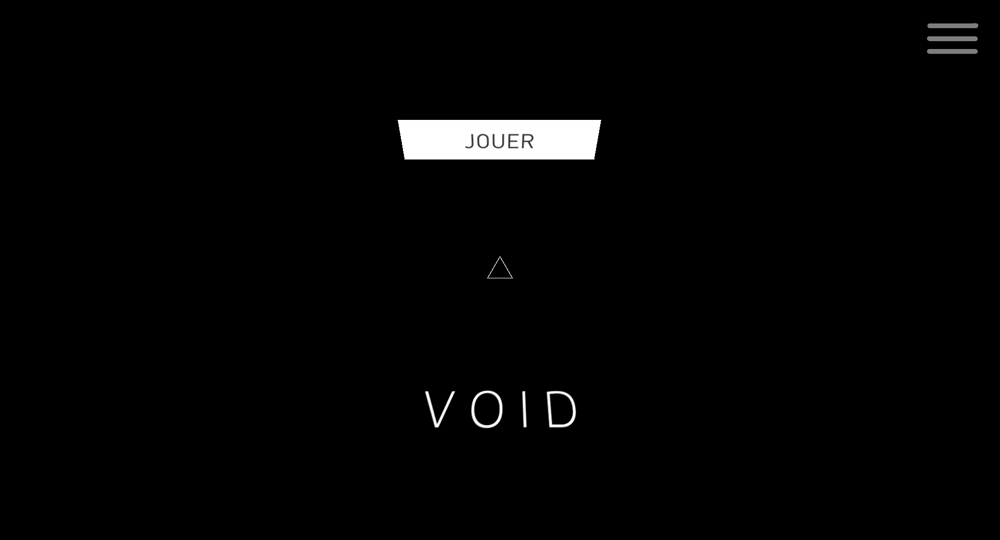
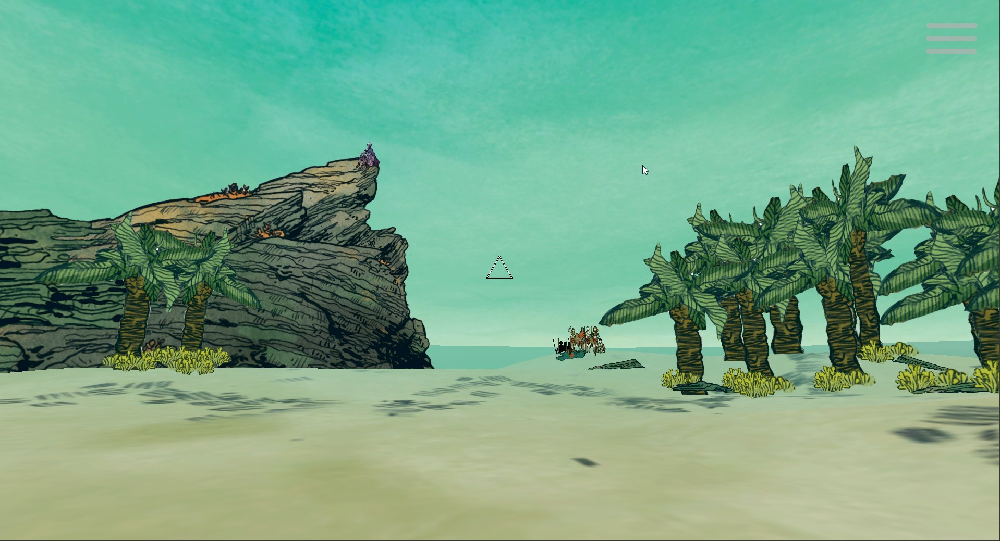
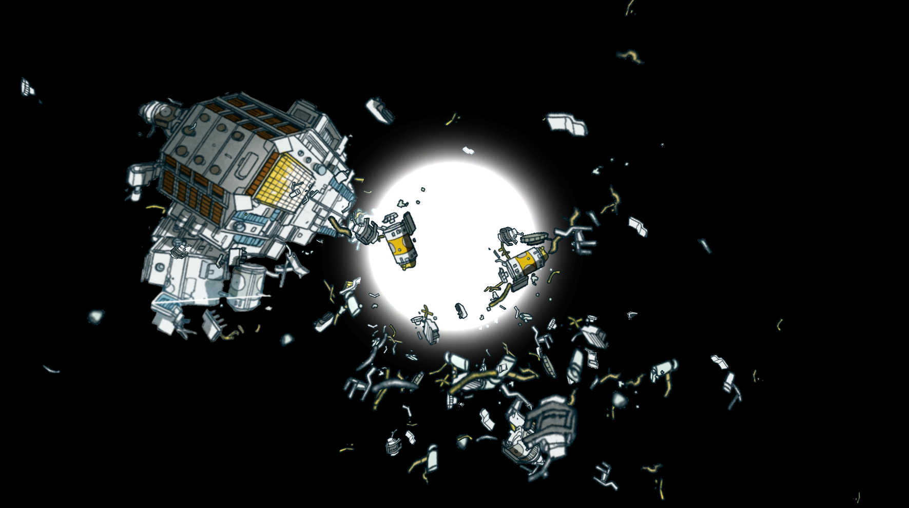
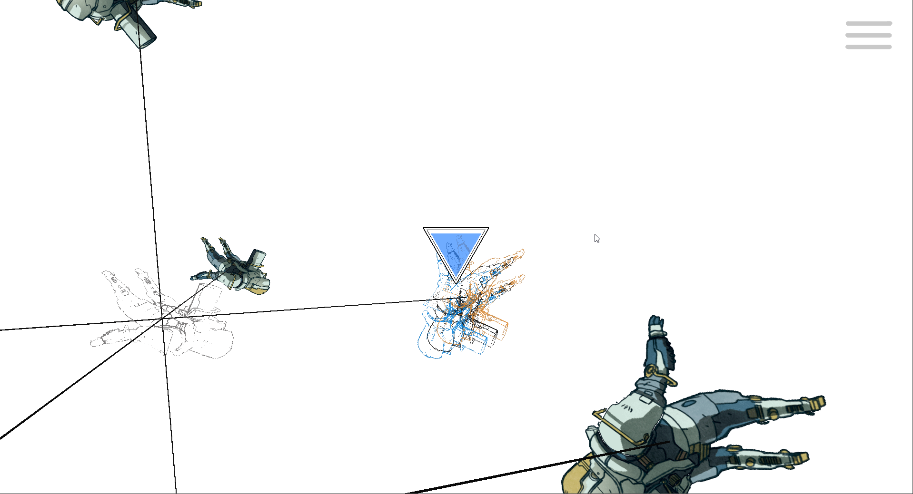

`unity | ~ minutes | puzzle | première personne`

Cette expérience était proposée dans le carde de : [C'est arrivé demain](https://www.poitiers.fr/cest-arrive-demain-la-bd-de-sf-envahit-poitiers-episode-1-planches-dessins-et-objets-de-collections), une exposition présentée par Le Miroir à Poitiers en 2017.

Dans ce dispositif les spectateurs sont amenés par le biais de tablettes munies d'un gyroscope à observer et se déplacer dans les espaces composés à partir des planches de la bande dessinée de [Mathieu Bablet](https://mathieubablet.ultra-book.com/), Shangri-La.

Chaque tablette est fixée au plafond par des accroches plastiques amovibles permettant de changer l’orientation de la tablette et ainsi le point de vue dans l’espace virtuel.
Un réticule au centre de l'écran permet de viser dans l'espace du jeu.

L’utilisateur est amené à fixer avec la tablette les éléments qui composent l’espace pour passer d’une vignette à l’autre (à la manière d’une narration hypertextuelle). 

Les environnements choisis dans la bande dessinée ont été détourés pour pouvoir jouer sur la parallaxe et la profondeur de champ.
Chaque espace propose plusieurs chemins et objets à collectionner qui permettent la complétion de l'expérience, mais les utilisateurs sont libres de rester dans le jeu aussi longtemps qu'ils le souhaitent.

Le end game est un hub central où tous les environnements sont visitables à nouveau.

