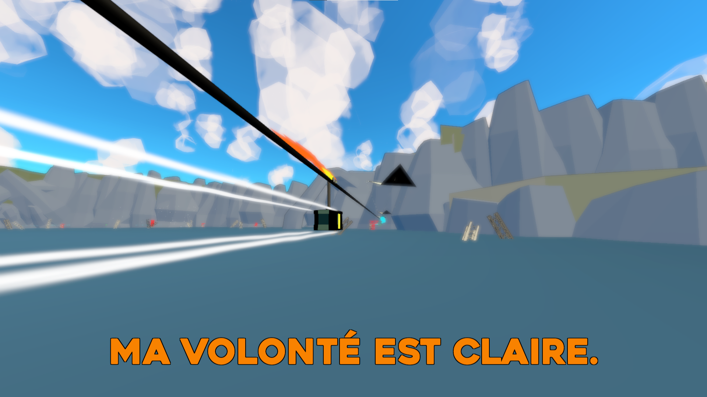
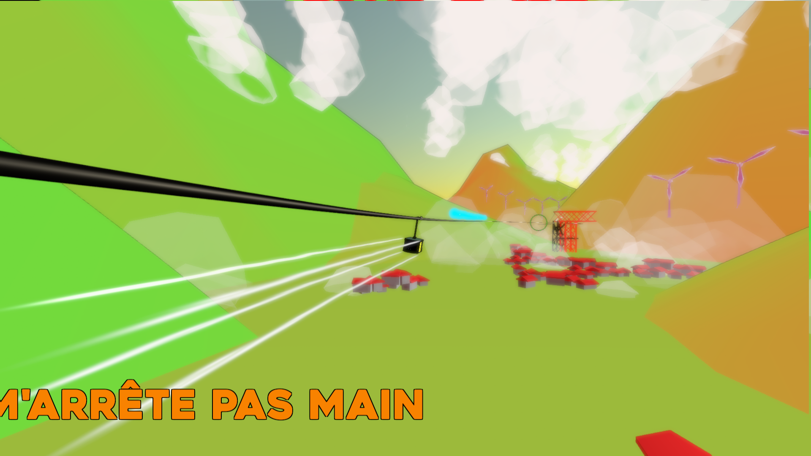
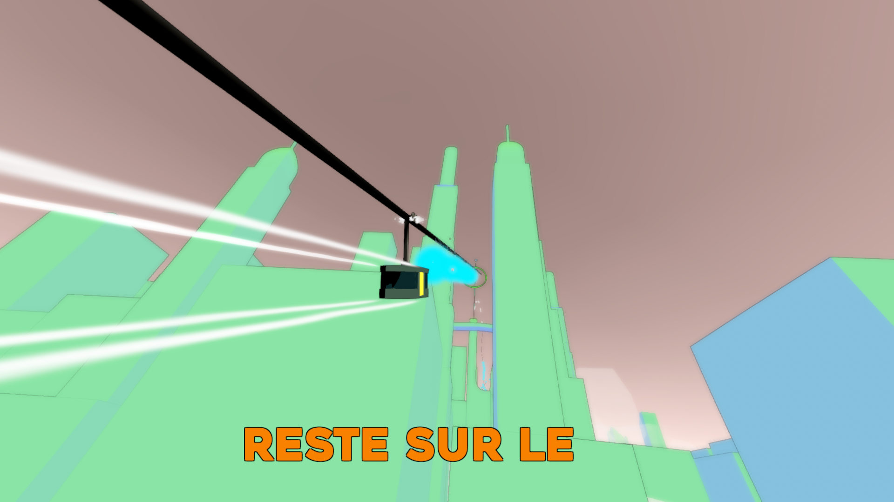

`unity | 20 minutes | course | troisième personne`

Dans Swift, vous incarnez une télécabine dans une course surnaturelle.
Swift, la télécabine, parcourt le monde liée à son câble. Sa vie est rythmée par des instants de repos, durant lesquels encouragée par la solitude, elle se pose des questions sur le chemin parcouru et à parcourir.

Et par des instants de courses folles qui la font virevolter accélérant à la faveur d'un virage, entre obstacles naturels et télécabines rivées au même sort ! 

Ainsi, sur le fil, elle se demande jusqu'où va son câble et si en atteindre le bout, signifie quelque chose.

Aidez Swift dans sa quête de liberté et son voyage introspectif au travers d'espace aussi variés que de longueur de câbles.