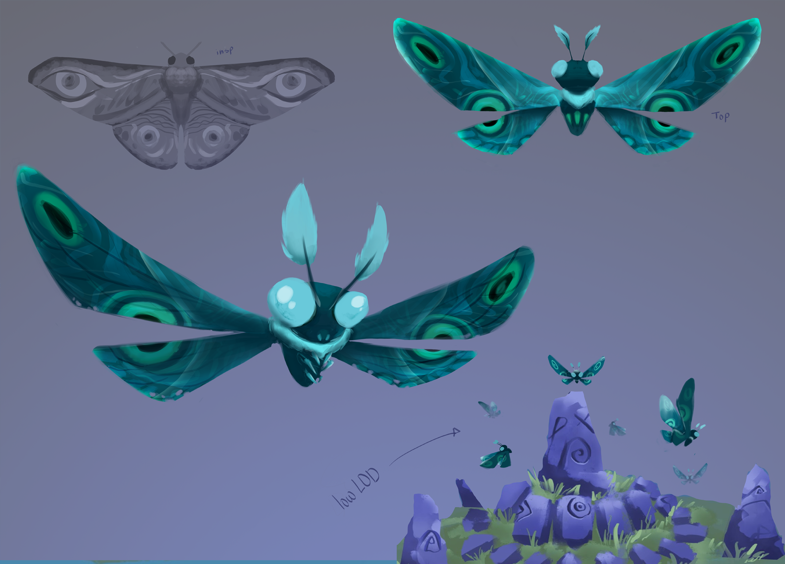
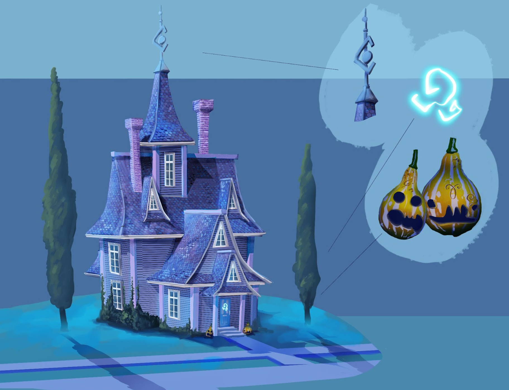
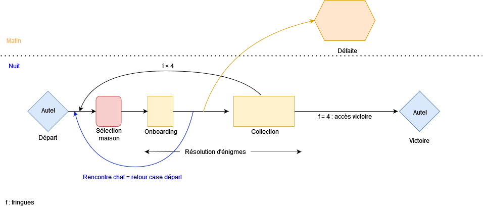
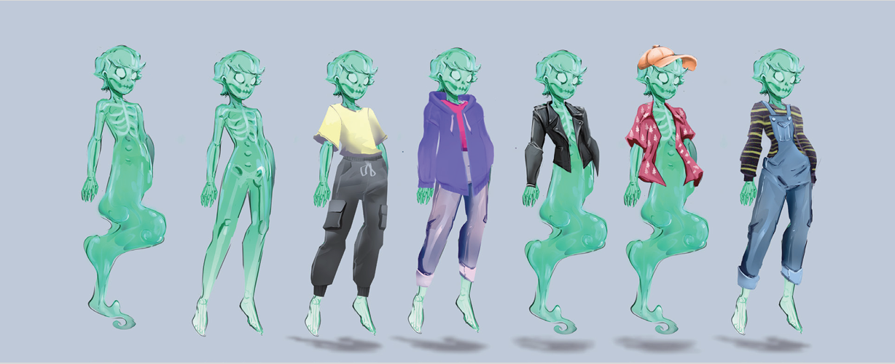
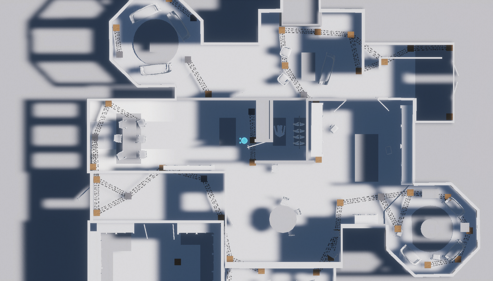
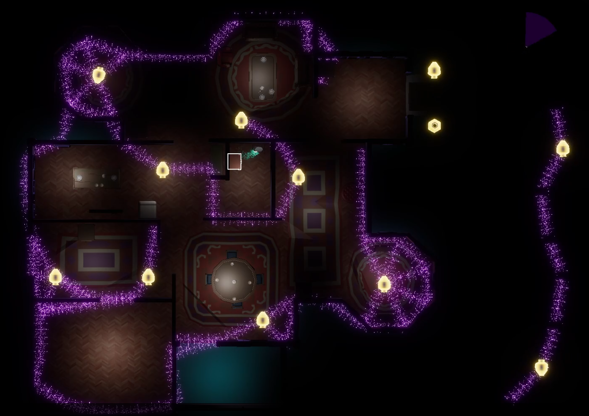
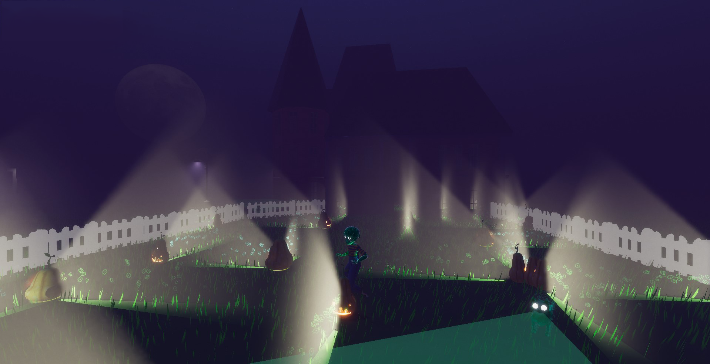
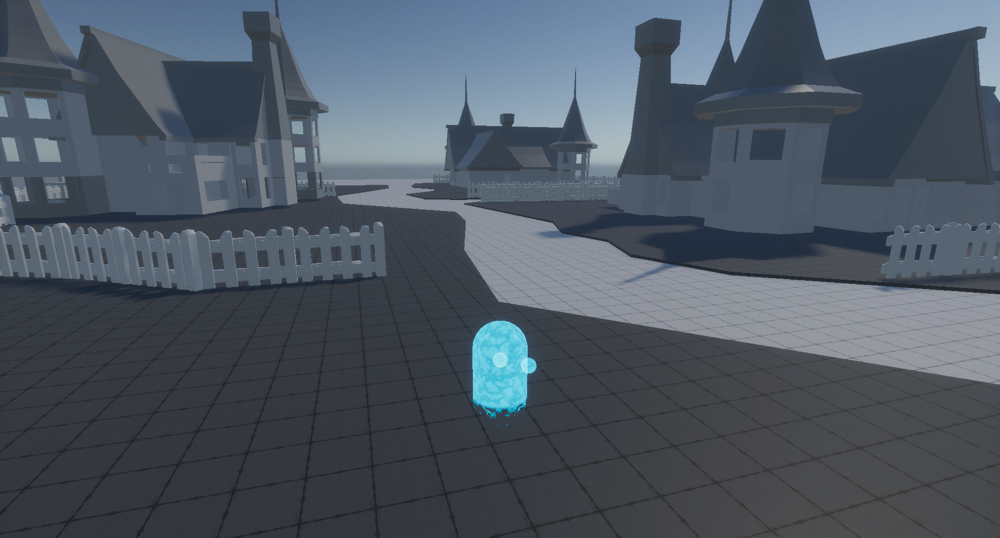

*logo togs - [Sebastian Pastor Ploskonka](https://www.artstation.com/plosko)*

`unity | 20 minutes | puzzle | troisième personne & top down`
[Itch.io](https://uce.itch.io/togs-memories)

### general

Togs Memories est une des productions de M1. Il s'agit d'un jeu complet, orienté puzzle, qui avait beaucoup plus d'ambitions que de temps disponible à la réalisation.

Dans Togs, on incarne le fantôme d'un ado récemment décédé qui a l'occasion de se réincarner s'il arrive à se trouver un outfit parfait (pour les joueureuses) avant la fin de la nuit des morts. Il doit voler les vêtements préférés des personnes vivants dans un petit quartier. Les gens vivant ici ont l'habitude de cet événement, et protègent leurs maisons moyennant des sigils. Une fois l'outfit parfait trouvé, il le valide auprès de son gardien (un papillon) et le voilà réincarné. 

*notre gardien*

[[Top]](#top)

les features cuts : 
- protecteurs fantômes humanoïdes des maisons
- joutes verbales
- fouiller dans TOUS les vêtements des gens
- rencontre avec des fantômes des précédents habitants

Bon, autant de features intéressantes que difficiles à développer en si peu de temps (nous disposions de quelque chose comme 4 mois en parallèle des cours). Nous nous sommes donc concentrés sur les vêtements, les puzzles et les gardiens (des chats).

*concept d'une des maisons*

[[Top]](#top)

### GD
Le gameplay se coupe en deux états co-dépendants : l'exploration et les puzzles. Pendant la phase d'exploration le temps continue de tourner, c'est le moment où a choisi la maison dans laquelle on va chiper des fringues. Pendant les puzzles, le temps s'arrête de tourner, on doit parvenir au centre de la maison et prendre la fringue qui nous intéresse.

*flowchart*

[[Top]](#top)

#### le personnage
Le personnage possède trois niveaux d'évolution, blop informe, demi-humanoïde, complet humanoïde qui permet de témoigner de l'avancé dans le jeu.

*concept de l'évolution du personnage*

[[Top]](#top)

#### les puzzles: intérieur
- Chaque maison est protégée, à l'intérieur, par des symboles qui forment des barrières. Comme on est un fantôme, ils ne sont pas tellement impactant. Mais dès qu'on possède la fringue de la maison, on ne peut plus passer au travers des murs, le puzzle prend tout son sens et sa difficulté.

*early vue des puzzles*

- Les sigils sont inscrits sur des éléments amovibles. On doit donc créer son propre chemin pour sortir des maisons avec la fringue choisie. Comme les fringues sont des éléments physiques, tangibles, on ne peut donc pas passer au travers des murs pour sortir.

- Pour s'orienter, les joueureuses peuvent allumer les lumières de la maison, mais la lumière fait disparaître les barrières magiques.

*la vue final*

[[Top]](#top)

#### les puzzles: extérieur

- Chaque maison est protégée, à l'extérieur, par des chats, gardien secret des jardins des maisons dans lesquels ils ont vécus. Ils parcourent le jardin, croiser leur regard nous expulse du jardin et impose un cooldown de 20 secondes.

*concept du chat*

*les chats dans les jardins*

[[Top]](#top)

#### les rues
- Dans les rues, on fait son propre défilé. C'est le moment où on choisi son outfit parmi toutes les fringues qu'on a trouvées. Une fois la tenue choisie, on la valide auprès de notre gardien.

*early stage du jeu*

## team
Game Programmer: PEIGNAUX Joachim [itch.io](https://metaldraco.itch.io/) | [linkedin](https://www.linkedin.com/in/joachim-peignaux/)

Sound Designer: BROUSSAUD Gaspard [itch.io](https://lanire.itch.io/) | [linkedin](https://www.linkedin.com/in/gaspard-broussaud/)

Graphic Artist: PASTOR Sebastian [artstation](https://www.artstation.com/plosko) | [linkedin](https://www.linkedin.com/in/sebastian-pastor-ploskonka-b5184b2a5/?originalSubdomain=fr)

UI/UX/UR Designer: DI ROSA Allan [itch.io](https://itch.io/profile/captain0) |  [linkedin](https://www.linkedin.com/in/allan-di-rosa-17954015b/)