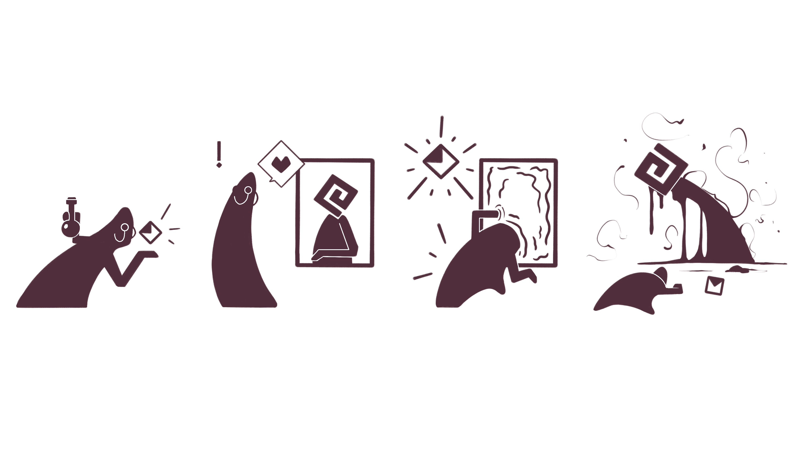
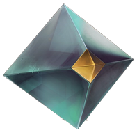
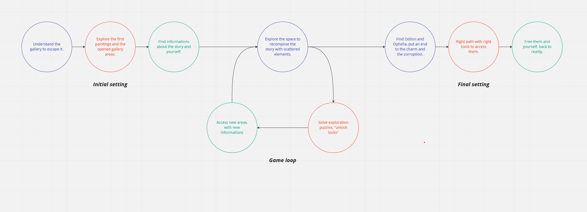
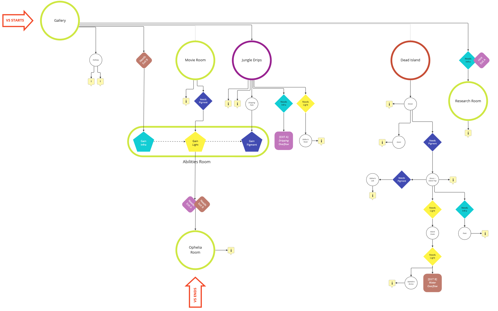
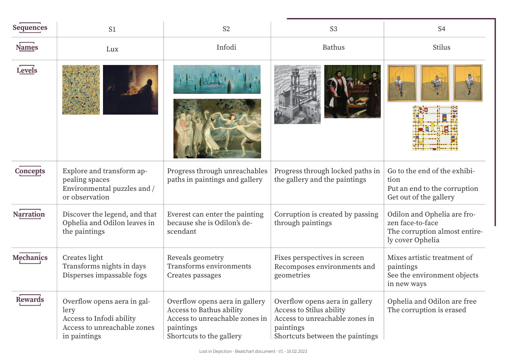
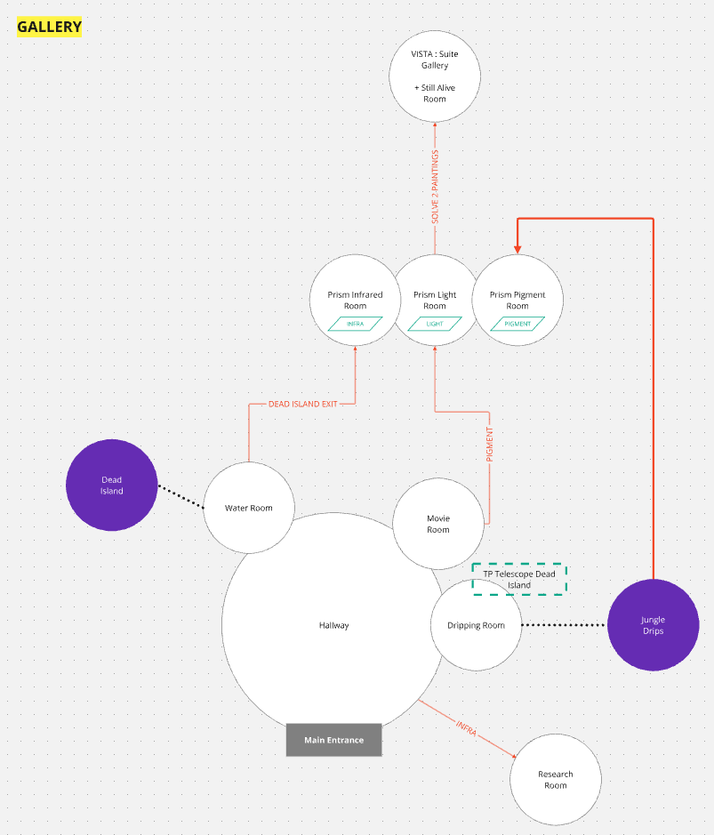
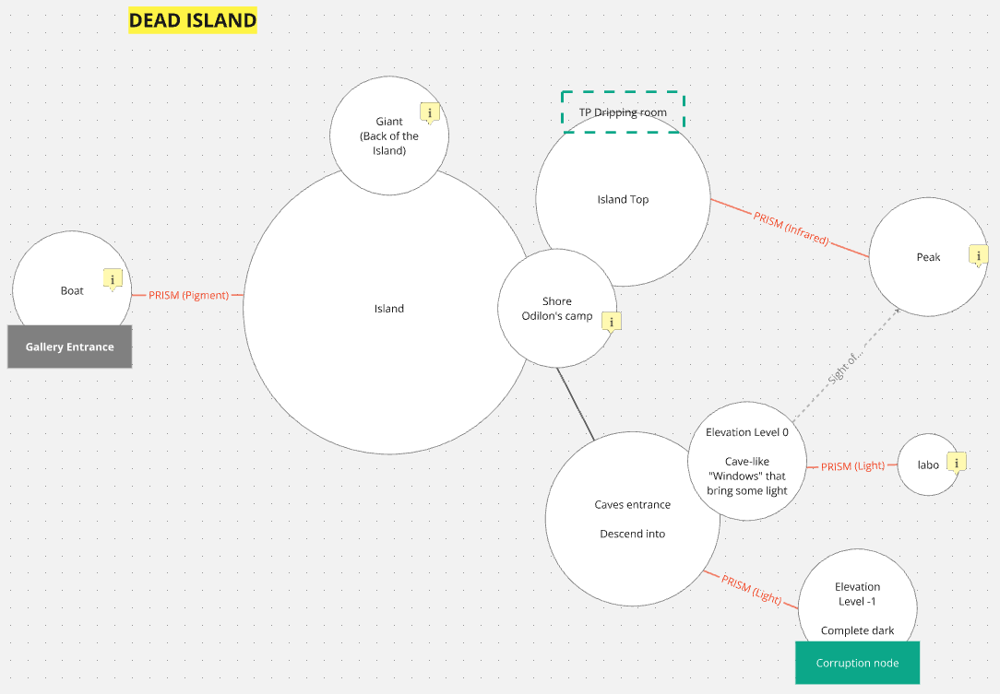
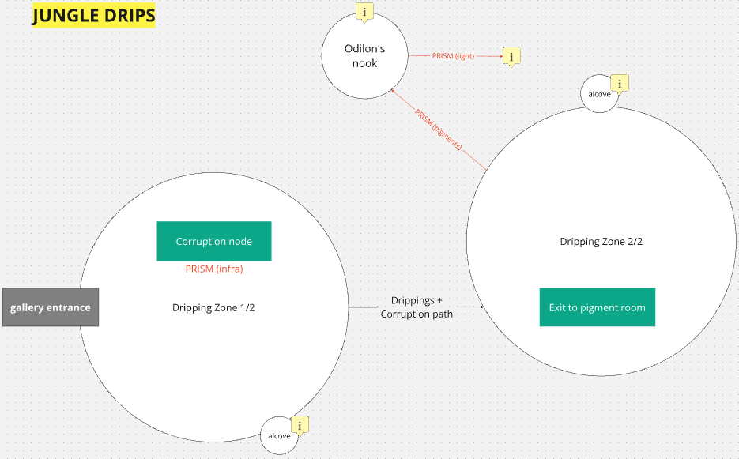

*logo LID - [Rachel Dufossé](https://racheldfs.artstation.com/)*

`unity/10 min/knowledgevania/première personne`

---

Lost in Depiction est le projet de Master sur lequel j'ai été co GD, LD et inté. L'exercice consiste en une verticale slice jouable, d'une dizaine de minute.

On a fini par désigner LID comme un knowledgeVania, à la manière de OutterWilds (cetait_la_mode_a_lepoque.jpg), où il faut trouver les informations pour résoudre l'énigme qui nous enferme.

Dans LID on se retrouve enfermé dans une galerie d'art, une nuit et notre seule solution pour nous échapper, est de fouiller la galerie et d'entrer dans les tableaux exposés. Chaque tableau donne accès à un pouvoir, dont l'usage va être challengé, et contient de la corruption à nettoyer pour obtenir le savoir qu'il renferme.

En fin de compte notre plus gros problème dans le développement a été de scoper correctement, ce qu'on a pas su faire, évidemment. Donc nous avons travailler sur deux tableaux et deux pouvoirs  au lieu de trois.

*Odilon*

---

## GD
### pouvoirs
Pour la VS nous avons développé trois pouvoirs qui reprennent des notions liés à la peinture : la lumière, la texture, la couleur et la perspective.
- À l'aide d'un prisme qui renferme les pouvoirs à collectionner, nous parcourons des espaces.

*prisme sans pouvoir au début du jeu*

- Les pouvoirs s'ajoutent au prisme, l'intérieur de celui-ci change en fonction du pouvoir choisi.

*prisme avec les pouvoirs*

[[Top]](#top)

#### la lumière : lux
Le pouvoir de lux permet d'envoyer des sphères de lumière, posées astucieusement, elles permette d'avancer dans les environnement. On peut lancer un total de 4 sphères.

[[Top]](#top)

#### la texture : infodi
Infodi fixe l'environnement, le transforme. Le pouvoir est combinable avec la lumière.

[[Top]](#top)

### gameloop
Donc très vite nous avons synthétisé une gameloop sur laquelle toute l'équipe à pu s'appuyer pour développer le jeu.

[[Top]](#top)

### flowchart
Nous avons choisi d'abattre un maximum de travaille théorique pour raccourcir au maximum le temps de réalisation dans le moteur.

[[Top]](#top)

### beatchart
Une beatchart pour résumer efficacement tout ça pour le jury.

[[Top]](#top)

## LD théorique
### la galerie 
Cet espace est le hub ou se trouve les pouvoirs et la collection de savoir qu'on obtient pendant l'exploration des tableaux. Il s'agrandit en même temps que la collection d'information augmente et est soumis aux règles du prisme. 

### tableau : dead island

### tableau : jungle drip

## team

Game desingner: [REY Antoine](https://toinou.fyi/)

Lead/Game Artist: DUFOSSE Rachel [itch.io](https://racheldfs.itch.io/) | [linkedin](https://www.linkedin.com/in/rachel-dufossé)

Sound Designer: BROUSSAUD Gaspard [itch.io](https://lanire.itch.io/) | [linkedin](https://www.linkedin.com/in/gaspard-broussaud/)

Gameplay Programmer: FOURAY Nino [itch.io](https://1singe.itch.io/) | [linkedin](https://www.linkedin.com/in/nino-fouray-2ba674255/)

Technical Artists: HUYNH Camille [itch.io](https://shynis.itch.io/) | [linkedin](https://www.linkedin.com/in/camille-huynh/) & HORION Raphaël [itch.io](https://radonraph.itch.io/) | [linkedin](https://www.linkedin.com/in/raphael-horion-80080b1b9/)

Producer: GAILLARD Téo [itch.io](https://teogaillard.itch.io/) | [linkedin](https://www.linkedin.com/in/teo-gaillard-028194172/)