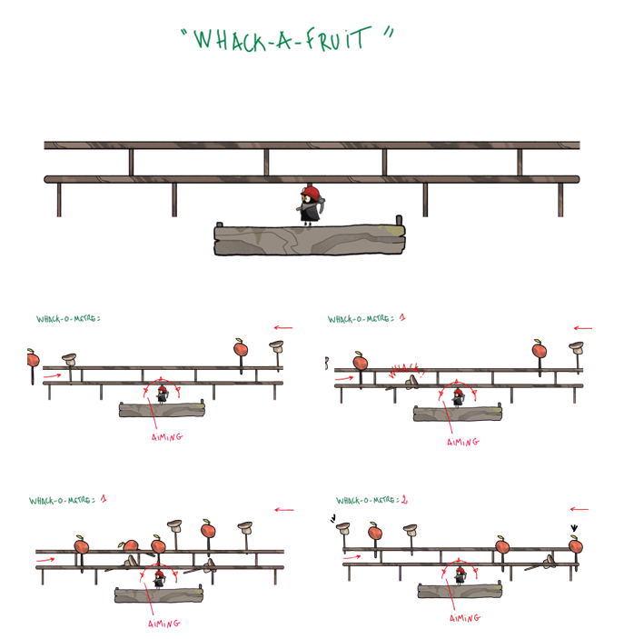

`unity/8h/recyclevania/sidescroll 2D`

*Les Merlies* est un side scroller 2D avec un double cœur gameplay, de l'exploration type metroidvania et du toy type village building.

Autour des thématiques écologiques (conservation de l'environnement, "upcycling"), on incarne des petits êtres, empruntés aux folklores nordiques, qui subissent la violence des changements climatiques et cherchent à s'organiser en communauté pour survivre.

Sur les Merlies, je suis GD et LD. 
- Chaque features développées à comme condition d'être liées autant au village qu'à l'exploration.
- Les features doivent nous faire ressentir la nécessité du groupe (exploration) et de la communauté (village).
- En LD il est important de garder en tête le public cible du jeu : hyper casu à gamers, si bien qu'il faut combiner un main path très accessible entourés de zones plus complexes.
- L'intégration des mises en scène orientées challenge ou narration à demandé une passe supplémentaire de documentation, afin de séquencer l'événement et de prendre du recul sur les tools manquants, ou les chemins de travers envisageables pour obtenir la bonne sensation en jeu.

À partir d'ici vous trouverez une suite de docs sur laquelle j'ai travaillé seul ou à 6 mains et une contextualisation. Il s'agit de screenshots extraits d'une doc plus complète.

[[Top]](#top)

## GD - village

### fanzine
Cette feature de fanzine devait lier le village et l'exploration et donnait :
- une vision sur la progression aux joueureuses via un aperçu des zones découvertes et les aventures arrivées dans ces zones.
- une sensation de vie au village avec des Merlies non-jouables qui écrivent les histoires qu'ils ont vécues pendant qu'on était en exploration.

Cependant, elle a été cut car le jeu ayant changé en profondeur, elle ne correspondait plus à l'ambiance du jeu.

*fanzine des Merlies*

[[Top]](#top)

### mini-jeux
Le village demande un minimum d'entretien pour que les Merlies soient contents et que de nouveaux Merlies arrivent. L'entretient revêt deux formes : 
- les mini-jeux avec les Merlies habitants de la souche : 
	- cache-cache
	- visite guidée
	- corde à sauter
- et les corvées : 
	- ramasser les feuilles mortes
	- nettoyer
	- réparer après une tempête.

`Bref ça prend cette forme là :`

*les mini-jeux*

Parfois, c'est plus simple de faire des schémas, alors :

*whack a mole*

[[Top]](#top)

## GD - exploration

### characters
Les Merlies se déplacent en groupe, on ne peut pas quitter le village avec un Merlie seul. Le principe de "faire communauté", "plus fort ensemble" nous suit partout. Les Merlies qui partent en exploration sont chacun doté d'une capacité : 
- un parasolier qui plane 
- un grappler qui s'accroche 
- un miner qui casse les cailloux
- un diver qui, spoiler, nage
- un luciolier qui nous éclaire.

*parasolier*

 
*diver*

[[Top]](#top)

## LD - exploration

*watcher zone*

*miner zone*

[[Top]](#top)

## intégration

Extrait de sequencer pour le prologue. Le bullet point contient autant d'information de mise en scène que le type de tools utilisé. Cette liste permet d'envisager les types de features qu'il manque et, ou de se mettre au point sur des précisions de mise en scène.

[[Top]](#top)