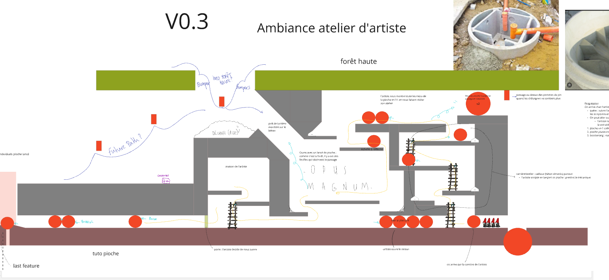

`unity/8h/recyclevania/sidescroll 2D`

Les Merlies est un side scroller 2D avec un double coeur gameplay, de l'exploration type metroidvania et du toy type village building.

Autour des thématiques écologiques (conservation de l'environnement, "upcycling"), on incarne des petits êtres, empruntés aux folkores nordiques, qui subissent la violence des changements climatiques et cherchent à s'organiser en communauté pour survivre.

Sur les Merlies, je suis GD et LD. 
- Chaque features développées à comme condition essentielle d'être liées autant au village qu'à l'exploration.
- Les features doivent nous faire ressentir la nécessité du groupe (exploration) et de la communauté (village).
- En LD il est important de garder en tête le public cible du jeu : hyper casu à gamers, si bien qu'il faut réussir à combiner un main path très accessible entourés de zones plus complexes pour créer du challenge pour ceux qui souhaite collectionner tous les items.
- L'intégration des mises en scène orientés challenge ou narration à demandé une passe supplémentaire de documentation, afin de séquencer l'évenement et prendre du recule sur les tools manquants, ou les chemins de travers envisageables pour obtenir la bonne sensation en jeu.

A partir d'ici, vous trouverez une suite de doc sur lesquels j'ai travaillé seul ou parfois à 6 mains et une contextualisation. Il s'agit de screenshot extraits d'une doc plus complète, donc nécessairement peu compréhensible en l'état.

[[Top]](#top)

## GD - village

### fanzine
Cette feature de fanzine devait lier le village et l'exploration et donnait:
- une vision sur la progression aux joueureuses via un apperçu des zones découvertes et les aventures arrivée dans ces zones.
- une sensation de vie au village avec des Merlies non jouables qui écrivent les histoires qu'ils ont vécu pendant qu'on était en exploration.

Cependant, elle a été cut car le jeu ayant changé en profondeur, elle ne correspondait plus à l'ambiance du jeu.

*fanzine des Merlies*

[[Top]](#top)

### mini-jeux
Le village demande un minimum d'entretient pour que les Merlies soient contents et que de nouveaux Merlies arrivent. L'entretient revêt deux formes : 
- les mini-jeux avec les Merlies habitants de la souche : 
	- cache-chache, visite guidée, corde à sauté,
- et les corvées : 
	- ramasser les feuilles mortes, nettoyer et réparer après une tempête.

`Bref ça prend cette forme là :`

*les mini-jeux*

Parfois, c'est plus simple de faire des schéma, alors :

*whack a mole*

[[Top]](#top)

## GD - exploration

### characters
Les Merlies sont des petits êtres qui se déplacent en groupe, on ne peut pas quitter le village avec un Merlie seul. Le principe de "faire communauté" doit nous suivre partout. Nous en sommes arrivés assez vite à la conclusion que certain Merlies aiment partir en exploration, et que ceux-ci sont dotés d'une capacité particulière. On trouve : un parasolier qui plane, un grappler qui s'accorche, un miner qui casse les cailloux, un diver qui, spoiler, nage.

 
*diver*

*parasolier*

[[Top]](#top)

## LD - exploration

*observator zone*

*miner zone*

[[Top]](#top)

## intégration

[[Top]](#top)