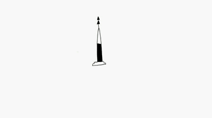
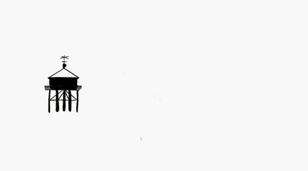
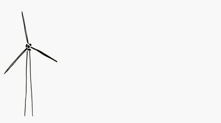

`installation projection ou télés | ~ minutes | animations`

Minimes est un ensemble d'animation en faux fixe d'objets gigantesques, de facture humaine. Détouré de toute anecdote l'objet flotte dans l'espace et donne un objectif à suivre du regard.
Comme lors d'un transport.
Ici, trois des animations réalisée pour le projet :

Les animations de minimes sont toujours exposées ensemble. Projeté ou installées comme on accroche des cartes postales : à côté et au-dessus les unes des autres, ou dans un empilement de télés cathodiques.