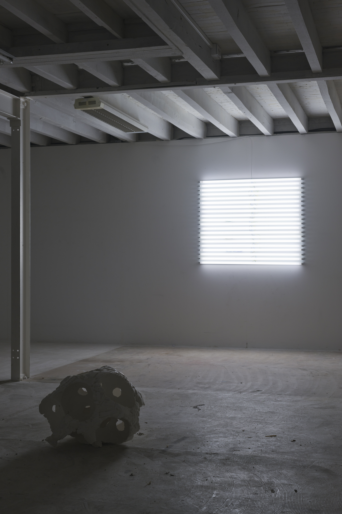
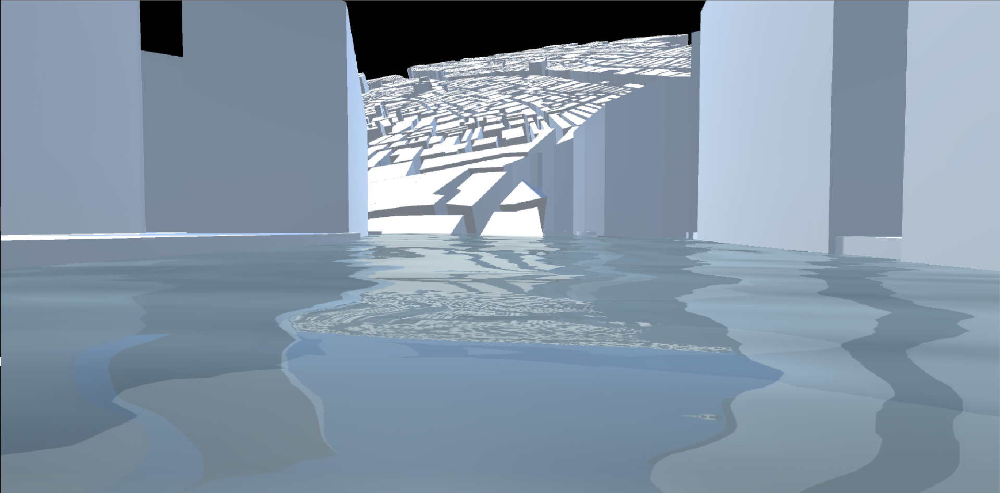
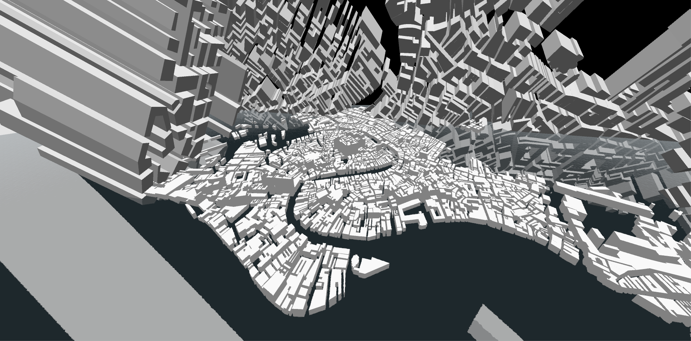

J'ai articulé mon DNSEP (diplôme national supérieur d'expression plastique) et l'intégralité de mon travail d'artiste plasticien autour de la science-fiction des années 80-90 et de l'obsession de certains écrivains pour les nouvelles technologies et le témoignage de la transformation rapide du monde.

On y trouve de la VR, des néons, du bétons, des paysages d'informations, dans une mise en scène sans anecdote.

Je voulais parler de jeux vidéo et d'espace non-tangible par des moyens détourné que simplement proposer une expérience vidéo ludique. Je ne voulais pas opposer le réel et le virtuel, mais les amener l'un dans l'autre.

`mais ça je l'ai compris plus tard`

### le béton

Ces colonnes de bétons sont des carottes comme celles de glace. Elles sont faites de couches successives de béton aux ratio sable/ciment différents. Leurs bases sont les plus sableuses et friables, leurs sommets plus compacts et denses. Moyennant quoi, c'était des pièces autour desquelles il était assez dangereux de stationner.

[[Top]](#top)

### les paysages

Ces photos représentent des paysages en reprenant les règles classiques du genre (format, 2/3 1/3). Certains softs de défrag de disques dur, donnent des représentations visuelles des éléments présents sur un disque dur. Les paramètres de chaque fichier (poids, genre, fonction) donnent des tailles de lignes et des couleurs différentes, à partir de ces conditions, c'était possible de créer des paysages.

[[Top]](#top)

### le néon

Dans la SF des années 80-90, on parle beaucoup de lumière néontique comme source lumineuse principale, voire qui remplace les sources naturelles. Le néon est alors une source lumineuse récente, qui prend une place prépondérante dans la vie quotidienne. J’ai assemblé des néons et les ai accrochés de façon à créer une frame identique à celle d’une fenêtre.

[[Top]](#top)

### la VR

Cette pièce de VR nous fait visiter une version 3D très approximative de Venise. J'ai représenté les blocs de bâtiments de la ville de Venise avec des polygones en 3D. Venise est une ville facilement reconnaissable pour des Européens, donc c'était intéressant comme base pour continuer de mélanger les mondes.

### overall

Dans l'ensemble, mon travail plastique est composé de matières brutes (le plâtre, le béton, le néon) sur lesquelles j'ai un impact minimal. Toutes les pièces existent ensemble et n'ont que peu d'intérêt séparées, et si elles n'apparaissent pas toutes en même temps, elles ne sont jamais présentées isolées.

[[Top]](#top)