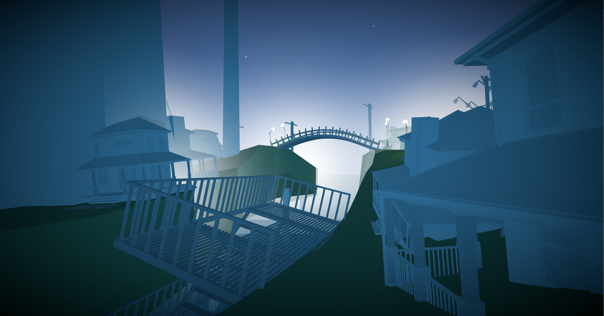
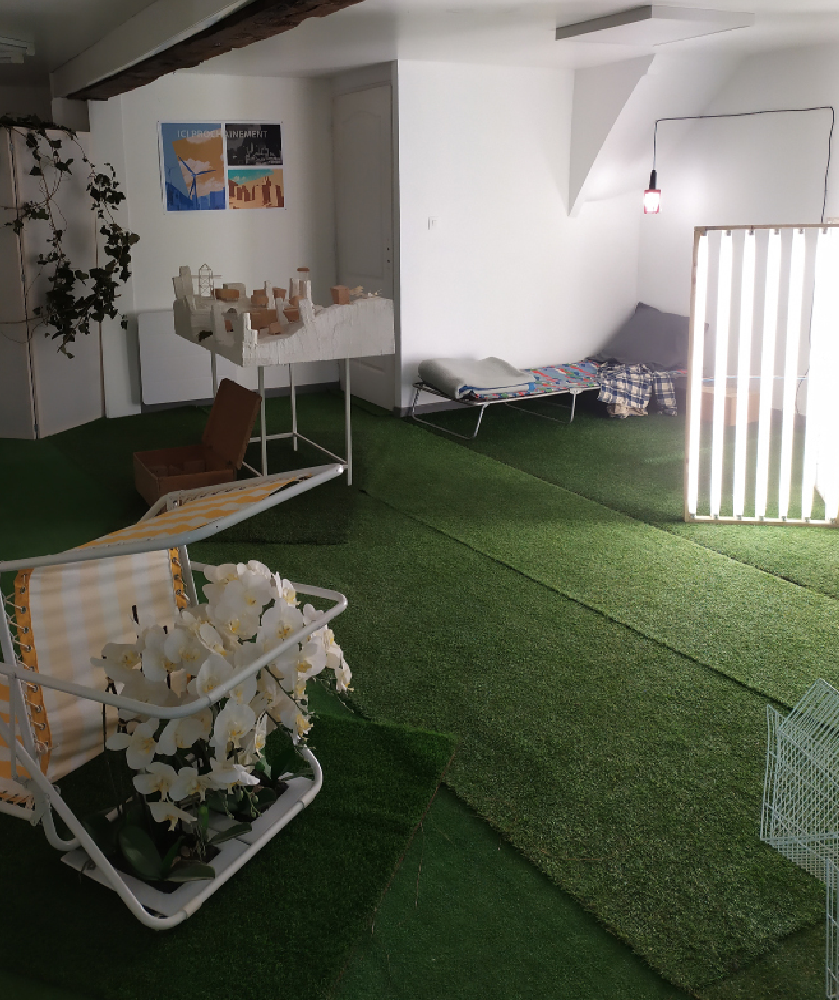

*logo DE PASSAGE - Vincent Kosellek*
[*DE PASSAGE*](http://www.chantierpublic.com/projets/expositions/index.html?tile=content/19-de-passage/content.md)
*Exploration* & *Appartement*
Une proposition de Vincent Kosellek, [Marianne Vieules](https://www.mariannevieules.space/) et Lucile Thierry (c'est moé)

Exploration `unity | 10 minutes | exploration | première personne`

Appartement `installation | vitrine | orchidées - lit de camp - néons - plâtres - lierre - chaise longue`

Un voyageur foule du pied le sol synthétique d'une colline artificielle. Devant lui, un espace en suspens. La ville qu’il aperçoit a pour seule rumeur le chant de milliers d'oiseaux. Des lampadaires percent faiblement la brume marine. Invitation à la découverte, leur lumière dessine un chemin.
Ni plate-forme ni île, ou peut-être les deux à la fois, l'impossible ville de Lierre se dresse. Elle est l'ultime terre ferme qui subsiste à la surface d'une planète rendue aux eaux. Elle n’appartient à aucun océan, aucun continent. Dans des temps si distants que l’on ne compte plus les dates, des temps où la vie sédentaire est devenue une antiquité, Lierre s’est construite telle un paradoxe monumental. Elle n’est approchée qu'occasionnellement, par quelques voyageurs que les courants ont rabattus par hasard vers son port. Le dernier véritable habitant de ce no man’s land est l’Architecte qui l’a imaginé.
Conçue en période de crise sanitaire, l'exposition De passage jette un regard embrumé sur les hypothèses d'effondrement sociétal. 
Elle propose l’évocation d’un esprit fou, celui d’un architecte qui sommeille en chacun de nous et qui rêve d’une permanence humaine devenue impossible. Cet esprit fou, envers et contre tout, développe une forme utopique propre à accueillir son aspiration.
De Passage est une double visite, un voyage à la frontière d'époques incompatibles. 
Exploration invite le visiteur-voyageur à explorer la ville de Lierre dans un espace numérique, entre ruine et chantier, en une époque où la présence discrète de l'Architecte se fait encore sentir. Vestiges satellitaires, lampadaires mobiles et bâtiments héliotropes sont autant de vestiges archéologiques d'une histoire disloquée.
Appartement se situe dans une époque plus lointaine, plus inconnue encore. Chantier Public s’ouvre aux visiteurs et dévoile une habitation, espace quasi-muséal qui laisse paraître les derniers reliquats de la vie de l'Architecte et de son projet. A l'extérieur, ne subsiste, comme toute trace d'une humanité devenue mythe, que d'étranges missives sans véritables destinataires, courriers perdus portés par les ultimes coursiers que sont devenus les oiseaux.

*DE PASSAGE* est une expérience double, un [jeu vidéo](https://uce.itch.io/de-passage-exploration) (*exploration*) et une exposition physique (*De passage*). Conçu pendant le confinement, *DE PASSAGE* est le témoin des questionnements qui nous ont traversé pendant cette période. Repenser les villes, repenser les communautés et les communication, repenser les responsabilités.

## Exploration

`unity|10 min|exploration|première personne`

*Exploration* 

## De passage

L'exposition